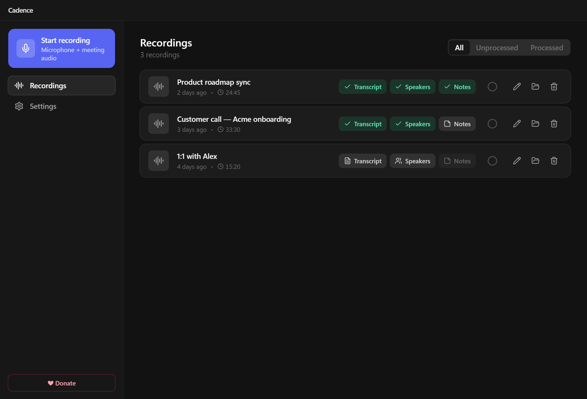
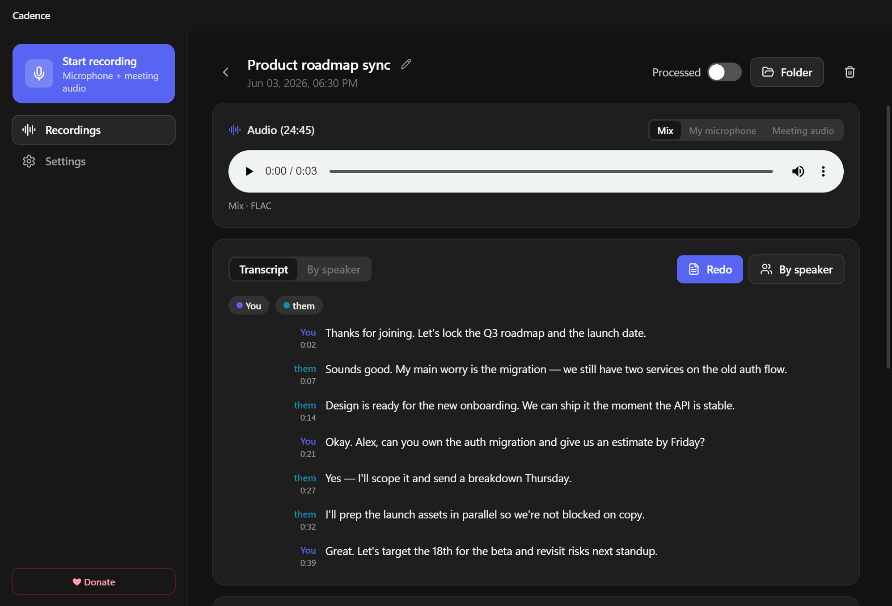
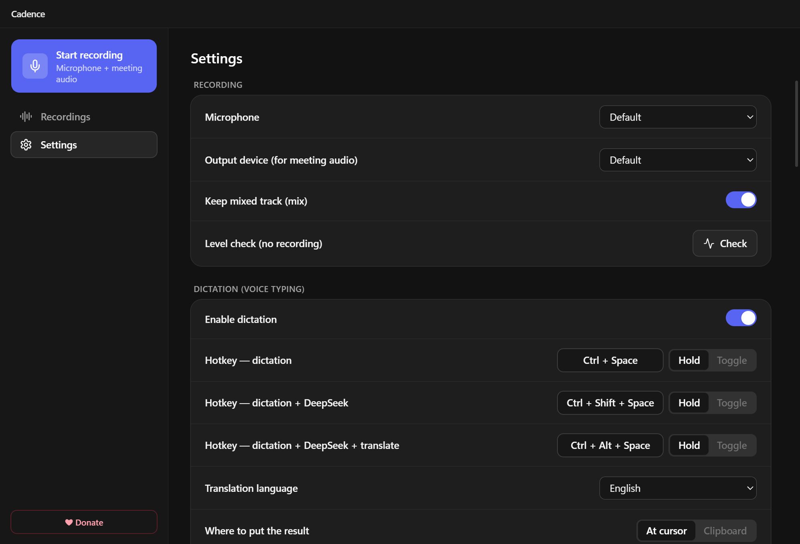

<div align="center">

# 🎙️ Cadence

**A private, local-first meeting recorder, transcriber & voice toolkit for Windows.**

Record your meetings, transcribe and diarize them on your own GPU, get AI meeting notes,
dictate with your voice, and have any text read aloud — all from a lightweight tray app.

[](https://github.com/bykcyc/Cadence/releases/latest)
[](https://github.com/bykcyc/Cadence/releases)
[](#-requirements)
[](LICENSE)
[](#-tech-stack)

**[⬇️ Download the latest release](https://github.com/bykcyc/Cadence/releases/latest)**

</div>

---

## Why Cadence?

Most meeting tools upload your audio to the cloud. **Cadence keeps recording, transcription
and speaker separation entirely on your machine** — nothing leaves your computer unless *you*
turn on an optional cloud feature (AI notes / read-aloud). It captures **your microphone and
the meeting audio as separate tracks**, so "you vs. them" is perfectly split before any AI runs.

## 📸 Screenshots

<p align="center">
  
</p>

<p align="center">
  
  &nbsp;
  
</p>

## ✨ Features

- **🎙️ Dual-track recording** — your mic and the meeting/system audio recorded separately (FLAC), plus a mixed track for playback. No virtual cable needed (WASAPI loopback).
- **📝 Local transcription** — NVIDIA **Parakeet TDT v3** on your GPU. Fast, multilingual, free.
- **👥 Speaker diarization** — **pyannote** splits multiple remote speakers (optional, needs a free Hugging Face token).
- **🧠 AI meeting notes** — concise summaries, action items and open questions via DeepSeek / OpenRouter / Mistral (editable prompt).
- **⌨️ Voice dictation — 3 global-hotkey modes:**
  - *Dictation* → raw speech-to-text inserted at the cursor.
  - *Dictation + DeepSeek* → cleaned-up, polished text.
  - *Dictation + DeepSeek + Translate* → polished **and** translated into a language of your choice.
- **🔊 Read aloud** — select any text, press a hotkey, and Cadence speaks it (Microsoft Edge neural voices).
- **🌍 14 interface languages** — English, Русский, 中文, Español, Français, Deutsch, Português, Italiano, 日本語, 한국어, العربية (RTL), हिन्दी, Türkçe, Polski.
- **🔒 Private by default** — recording, transcription and diarization run locally. Cloud is opt-in and clearly marked.
- **🖥️ Lives in the tray** — autostart with Windows, mac-style UI, one-click installer or portable build.

## 🔐 Privacy

| Feature | Where it runs |
|---|---|
| Recording, transcription (Parakeet), diarization (pyannote) | **100% local** on your machine |
| Meeting notes, dictation polish/translate (DeepSeek) | Cloud API — only if you add a key |
| Read-aloud (Edge voices) | Microsoft online service — only when you use it |

## 🚀 Getting started

1. Download the latest **`Cadence-Setup-x.y.z.exe`** (installer) or **`Cadence-x.y.z-portable.exe`** from [Releases](../../releases).
2. Run it. The app appears in the system tray.
3. On the **first transcription**, Cadence automatically sets up its local engine — it installs the
   [`uv`](https://github.com/astral-sh/uv) package manager (if missing), creates a Python environment,
   and downloads the speech model (cached afterwards). No console, no manual steps. By default this is
   the lightweight **ONNX** engine (no PyTorch, ~1 GB) which runs well on CPU. Switch to **NeMo** in
   *Settings → Recording* for GPU-accelerated transcription of long meetings — that engine pulls
   PyTorch (CUDA) + the full ML stack (~2–4 GB) on first use. Speaker diarization always uses NeMo.

> The build is unsigned, so Windows SmartScreen may warn on first launch → **More info → Run anyway**.

## 💻 Requirements

- **Windows 10 / 11 (x64).**
- **NVIDIA GPU recommended** for fast transcription. The default ONNX engine runs fine on CPU (~real-time-ish for typical meetings); the optional NeMo engine is much faster on long files but needs a CUDA GPU.
- **Internet on first run** (to download the engine + models) and for the optional cloud features.
- For **speaker diarization**: a free [Hugging Face](https://huggingface.co/settings/tokens) **read** token, and accept the licenses of `pyannote/speaker-diarization-3.1` and `pyannote/segmentation-3.0`.
- For **AI notes / dictation polish & translate**: an API key (DeepSeek by default; OpenRouter / Mistral also supported).

## 🛠️ Build from source

```bash
npm install
npm run dev          # development with HMR
npm run typecheck    # main + renderer type checks
npm run build:win    # NSIS installer + portable .exe in dist/
```

## 🧱 Tech stack

Electron + React + TypeScript + Tailwind (electron-vite, electron-builder) · NVIDIA Parakeet TDT v3
(NeMo) · pyannote.audio · FastAPI worker · `edge-tts` · `uiohook-napi` (global hotkeys) ·
`ffmpeg-static`.

## ⚖️ Models & third-party services

- **Parakeet TDT v3** (ASR) and **pyannote** (diarization) are downloaded from Hugging Face on first use. pyannote models are **gated** — you must accept their licenses on huggingface.co and use a read token.
- **Read-aloud** uses Microsoft **Edge** online neural voices via the community `edge-tts` client (intended for personal use; subject to Microsoft's terms).
- **Meeting notes / dictation polish & translate** call the LLM provider you configure (DeepSeek by default) with your own API key.

Cadence itself is MIT-licensed; the models and services above keep their own licenses/terms.

## 🤝 Contributing

Issues and pull requests are welcome — see [CONTRIBUTING.md](CONTRIBUTING.md).

## ❤️ Support

Cadence is free and open-source. If it saves you time, you can **[buy me a coffee](https://buymeacoffee.com/bykcycd)** ☕ — it directly supports development.

## 📄 License

[MIT](LICENSE) © Jurijs Ivanenko
